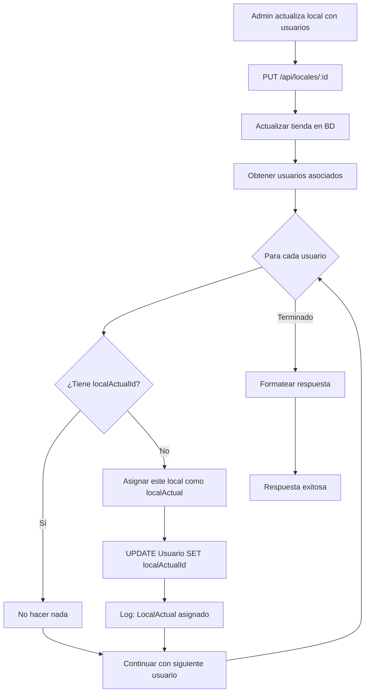

# 🏪 Asignación Automática de Local Actual

## 📋 Descripción

Cuando se actualiza un local (tienda o almacén) y se asocian usuarios a él, el sistema verifica automáticamente si alguno de esos usuarios **NO tiene un `localActual` asignado**. Si es el caso, se le asigna automáticamente el local al que se le está asociando.

---

## 🎯 Objetivo

Evitar que usuarios recién creados o sin local actual asignado queden sin configuración completa. Esta funcionalidad garantiza que:

1. ✅ Todo usuario asociado a un local tenga un `localActual` 
2. ✅ Los usuarios puedan acceder inmediatamente después de ser configurados
3. ✅ Se reduzca la configuración manual del administrador
4. ✅ La experiencia del usuario sea fluida desde el primer momento

---

## 🔍 ¿Cuándo se Activa?

### **Evento Disparador**
Cuando un administrador actualiza un local y asocia usuarios mediante:

**Endpoint:** `PUT /api/locales/[id]`

### **Condición**
Para cada usuario asociado al local:
- ✅ Se verifica si `usuario.localActualId === null`
- ✅ Si es `null`, se asigna automáticamente este local

---

## 🛠️ Implementación Técnica

### **Ubicación**
`src/app/api/locales/[id]/route.ts` (líneas 140-150)

### **Código**

```typescript
// Asignar localActual a usuarios que no lo tengan
for (const usuarioTienda of updatedTienda.usuarios) {
  // Si el usuario no tiene localActual asignado, asignarle este local
  if (!usuarioTienda.usuario.localActualId) {
    await prisma.usuario.update({
      where: { id: usuarioTienda.usuario.id },
      data: { localActualId: id }
    });
    console.log(`✅ LocalActual asignado automáticamente al usuario ${usuarioTienda.usuario.nombre} (ID: ${usuarioTienda.usuario.id})`);
  }
}
```

### **Cambios Realizados**

#### **1. Agregado `localActualId` en el select**
```typescript
usuario: {
  select: {
    id: true,
    nombre: true,
    usuario: true,
    rol: true,
    localActualId: true  // ← NUEVO
  }
}
```

**Motivo:** Necesitamos saber si el usuario ya tiene un `localActual` asignado.

#### **2. Bucle de asignación automática**
```typescript
for (const usuarioTienda of updatedTienda.usuarios) {
  if (!usuarioTienda.usuario.localActualId) {
    await prisma.usuario.update({
      where: { id: usuarioTienda.usuario.id },
      data: { localActualId: id }
    });
  }
}
```

**Motivo:** Asigna el local actual a usuarios que no lo tengan.

---

## 📊 Flujo de Ejecución



---

## 🎬 Escenarios de Uso

### **Escenario 1: Usuario Recién Creado**

**Situación Inicial:**
- ✅ Usuario creado en el sistema
- ❌ No tiene `localActualId` (es `null`)
- ❌ No puede loguearse (validación de usuario configurado lo bloquea)

**Acción:**
- Administrador edita un local
- Asocia el usuario recién creado al local
- Asigna un rol al usuario

**Resultado:**
- ✅ Usuario asociado al local
- ✅ **LocalActual asignado automáticamente** ← NUEVA FUNCIONALIDAD
- ✅ Usuario puede loguearse inmediatamente

**Sin esta funcionalidad:**
- ❌ Administrador tendría que asignar el `localActual` manualmente
- ❌ Usuario seguiría sin poder loguearse
- ❌ Más pasos de configuración

---

### **Escenario 2: Usuario con LocalActual Existente**

**Situación Inicial:**
- ✅ Usuario ya tiene `localActualId = 'local-A'`
- ✅ Puede loguearse normalmente

**Acción:**
- Administrador edita `local-B`
- Asocia este usuario a `local-B`

**Resultado:**
- ✅ Usuario asociado a `local-B`
- ✅ **LocalActual permanece como `local-A`** (no se modifica)
- ℹ️ Usuario puede cambiar manualmente su `localActual` cuando quiera

**Comportamiento esperado:**
- ✅ Solo se asigna si NO tiene `localActual`
- ✅ No sobreescribe `localActual` existente

---

### **Escenario 3: Usuario con Múltiples Locales**

**Situación Inicial:**
- ✅ Usuario asociado a 3 locales
- ❌ No tiene `localActualId` (es `null`)

**Acción:**
- Administrador edita `local-1` y actualiza usuarios
- Usuario ya está en la lista

**Resultado:**
- ✅ **Se asigna `local-1` como `localActual`** (primer local que se procesa)
- ✅ Usuario puede loguearse con `local-1` activo
- ✅ Puede cambiar a otros locales desde la UI

---

### **Escenario 4: Actualización de Local Sin Cambios en LocalActual**

**Situación Inicial:**
- ✅ Usuario tiene `localActual = 'local-A'`
- ✅ Usuario asociado a `local-B` y `local-C`

**Acción:**
- Administrador edita nombre de `local-B`
- No cambia usuarios asociados

**Resultado:**
- ✅ Nombre del local actualizado
- ✅ **LocalActual permanece como `local-A`** (no se toca)
- ℹ️ Sistema verifica pero no modifica porque ya tiene `localActual`

---

## 🧪 Casos de Prueba

### **Test 1: Usuario sin localActual**

**Setup:**
```sql
-- Crear usuario sin localActual
INSERT INTO Usuario (id, nombre, usuario, password, negocioId, localActualId)
VALUES ('user-1', 'Juan Pérez', 'juan', 'hash', 'negocio-1', NULL);
```

**Acción:**
```http
PUT /api/locales/local-1
{
  "nombre": "Tienda Principal",
  "tipo": "TIENDA",
  "usuariosRoles": [
    { "usuarioId": "user-1", "rolId": "rol-vendedor" }
  ]
}
```

**Resultado Esperado:**
```sql
-- Verificar asignación
SELECT localActualId FROM Usuario WHERE id = 'user-1';
-- Resultado: 'local-1' ✅
```

**Log en consola:**
```
✅ LocalActual asignado automáticamente al usuario Juan Pérez (ID: user-1)
```

---

### **Test 2: Usuario con localActual existente**

**Setup:**
```sql
-- Usuario ya tiene localActual
UPDATE Usuario 
SET localActualId = 'local-A'
WHERE id = 'user-2';
```

**Acción:**
```http
PUT /api/locales/local-B
{
  "nombre": "Tienda Secundaria",
  "tipo": "TIENDA",
  "usuariosRoles": [
    { "usuarioId": "user-2", "rolId": "rol-admin" }
  ]
}
```

**Resultado Esperado:**
```sql
-- Verificar que NO cambió
SELECT localActualId FROM Usuario WHERE id = 'user-2';
-- Resultado: 'local-A' ✅ (no cambió)
```

**Log en consola:**
```
(No hay log porque el usuario ya tenía localActual)
```

---

### **Test 3: Múltiples usuarios, algunos sin localActual**

**Setup:**
```sql
-- user-1: Sin localActual
UPDATE Usuario SET localActualId = NULL WHERE id = 'user-1';

-- user-2: Con localActual
UPDATE Usuario SET localActualId = 'otro-local' WHERE id = 'user-2';

-- user-3: Sin localActual
UPDATE Usuario SET localActualId = NULL WHERE id = 'user-3';
```

**Acción:**
```http
PUT /api/locales/local-1
{
  "usuariosRoles": [
    { "usuarioId": "user-1", "rolId": "rol-1" },
    { "usuarioId": "user-2", "rolId": "rol-2" },
    { "usuarioId": "user-3", "rolId": "rol-3" }
  ]
}
```

**Resultado Esperado:**
```sql
-- Verificar asignaciones
SELECT id, localActualId FROM Usuario WHERE id IN ('user-1', 'user-2', 'user-3');

-- user-1: 'local-1' ✅ (asignado)
-- user-2: 'otro-local' ✅ (no cambió)
-- user-3: 'local-1' ✅ (asignado)
```

**Log en consola:**
```
✅ LocalActual asignado automáticamente al usuario [user-1] (ID: user-1)
✅ LocalActual asignado automáticamente al usuario [user-3] (ID: user-3)
```

---

## 📝 Logs y Debugging

### **Log de Éxito**
```javascript
console.log(`✅ LocalActual asignado automáticamente al usuario ${usuarioTienda.usuario.nombre} (ID: ${usuarioTienda.usuario.id})`);
```

**Información incluida:**
- ✅ Emoji visual (✅)
- ✅ Nombre del usuario
- ✅ ID del usuario

**Cuándo aparece:**
- Solo cuando se asigna automáticamente el `localActual`
- No aparece si el usuario ya tenía `localActual`

### **Ejemplo de Log en Producción**
```
Actualizando con usuariosRoles: [
  { usuarioId: 'abc-123', rolId: 'rol-xyz' }
]
✅ LocalActual asignado automáticamente al usuario María García (ID: abc-123)
```

---

## 🔧 Consideraciones Técnicas

### **Performance**
- ✅ Se ejecuta solo para usuarios sin `localActual`
- ✅ Usa `UPDATE` individual por usuario (no hay batch update en este caso)
- ⚠️ En casos de muchos usuarios sin `localActual`, podría ser ligeramente lento
- ✅ En la práctica, la mayoría de usuarios ya tendrán `localActual`

**Optimización futura (si es necesario):**
```typescript
// Batch update (si hay muchos usuarios)
const usuariosSinLocal = updatedTienda.usuarios
  .filter(u => !u.usuario.localActualId)
  .map(u => u.usuario.id);

if (usuariosSinLocal.length > 0) {
  await prisma.usuario.updateMany({
    where: { id: { in: usuariosSinLocal } },
    data: { localActualId: id }
  });
}
```

### **Transaccionalidad**
- ✅ La actualización de la tienda está en una transacción implícita
- ⚠️ Los updates de usuarios están fuera de esa transacción
- ℹ️ Si falla un update de usuario, la tienda ya está actualizada

**Mejora futura (si se requiere transacción completa):**
```typescript
await prisma.$transaction(async (tx) => {
  const updatedTienda = await tx.tienda.update({...});
  
  for (const usuarioTienda of updatedTienda.usuarios) {
    if (!usuarioTienda.usuario.localActualId) {
      await tx.usuario.update({...});
    }
  }
});
```

### **Compatibilidad**
- ✅ No afecta la respuesta del API
- ✅ No rompe el frontend existente
- ✅ Solo agrega funcionalidad, no modifica comportamiento existente

---

## ✅ Beneficios

| Beneficio | Descripción |
|-----------|-------------|
| **🚀 Configuración más rápida** | Administrador no necesita pasos adicionales |
| **✅ Menos errores** | Usuarios no quedan sin `localActual` |
| **😊 Mejor UX** | Usuarios pueden loguearse inmediatamente |
| **🔄 Automático** | No requiere intervención manual |
| **🛡️ Seguro** | Solo asigna si NO existe, no sobreescribe |

---

## 🆚 Antes vs Después

### **Antes de esta funcionalidad**

```
1. Admin crea usuario
2. Admin asocia usuario a local
3. Admin asigna rol al usuario
4. ⚠️ Usuario intenta login → BLOQUEADO (sin localActual)
5. Admin tiene que asignar manualmente localActual
6. ✅ Usuario puede loguearse
```

**Pasos:** 6️⃣ | **Configuración manual:** ✅

---

### **Después de esta funcionalidad**

```
1. Admin crea usuario
2. Admin asocia usuario a local (con rol)
   → ✅ LocalActual asignado automáticamente
3. ✅ Usuario puede loguearse inmediatamente
```

**Pasos:** 3️⃣ | **Configuración manual:** ❌

---

## 🔐 Interacción con Otras Validaciones

Esta funcionalidad trabaja en conjunto con:

### **1. Validación de Usuario Configurado**
- ✅ La asignación automática evita que usuarios queden sin `localActual`
- ✅ Reduce la probabilidad de error `USUARIO_SIN_CONFIGURAR`

### **2. Redirección después de Selección de Local**
- ✅ Si el usuario tiene `localActual` asignado automáticamente
- ✅ Puede loguearse directamente sin necesidad de selector

### **3. Cambio Manual de Local**
- ✅ Usuario puede cambiar su `localActual` desde la UI cuando quiera
- ✅ Esta funcionalidad solo establece el valor inicial

---

## 📊 Estadísticas Útiles

### **Consulta: Usuarios sin localActual**
```sql
SELECT COUNT(*) as usuarios_sin_local
FROM Usuario
WHERE rol != 'SUPER_ADMIN' 
  AND localActualId IS NULL;
```

### **Consulta: Usuarios que recibirían asignación automática**
```sql
SELECT u.id, u.nombre, u.usuario, ut.tiendaId
FROM Usuario u
INNER JOIN UsuarioTienda ut ON u.id = ut.usuarioId
WHERE u.rol != 'SUPER_ADMIN'
  AND u.localActualId IS NULL;
```

---

## 🎉 Resultado Final

Los administradores ahora pueden:

1. ✅ **Crear usuario**
2. ✅ **Asociar a local con rol** (en un solo paso)
3. ✅ **Usuario listo para usar** (sin pasos adicionales)

Los usuarios reciben:

1. ✅ **Configuración completa automática**
2. ✅ **Pueden loguearse inmediatamente**
3. ✅ **Experiencia fluida desde el inicio**

**¡Configuración de usuarios simplificada al máximo!** 🚀

