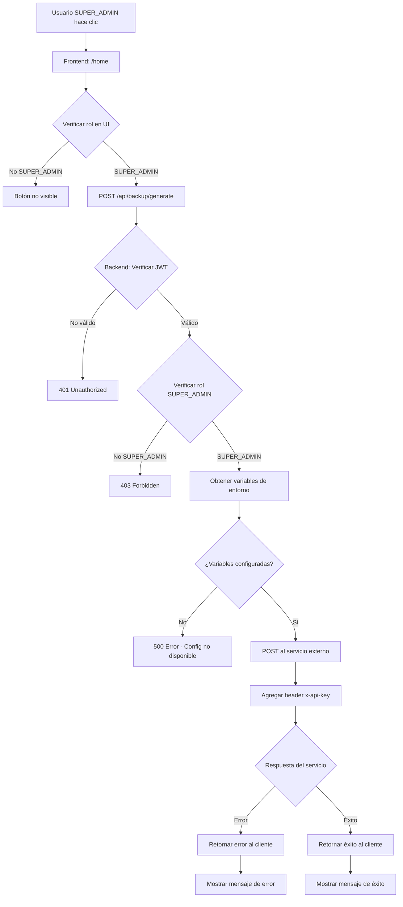

# 🗄️ Sistema de Backup de Base de Datos

## Resumen
Sistema de backup de base de datos disponible exclusivamente para usuarios **SUPER_ADMIN** desde el panel de control principal.

---

## 🎯 Características

### ✅ Funcionalidad Implementada

1. **Botón Visible Solo para SUPER_ADMIN**
   - Ubicación: Panel de Control (`/home`)
   - Color: Naranja (Warning)
   - Icono: Backup
   - Texto: "Generar Backup BD"

2. **Estados del Botón**
   - Normal: "Generar Backup BD"
   - Ejecutando: "Generando Backup..." con spinner
   - Deshabilitado durante la ejecución

3. **Seguridad**
   - Verificación de rol en el backend
   - Credenciales protegidas (no expuestas al cliente)
   - API route intermedia para seguridad

4. **Feedback al Usuario**
   - Mensaje inicial: "Generando backup de la base de datos..."
   - Éxito: "Backup generado exitosamente"
   - Error: Mensaje descriptivo del problema

---

## 🔧 Configuración

### Variables de Entorno Requeridas

Agrega estas variables a tu archivo `.env`:

```bash
# Backup Configuration
CALL_GENERATE_BACKUP_URL="https://tu-servicio-backup.com/api/generate"
CALL_GENERATE_BACKUP_SECRET="tu-api-key-secreta-aqui"
```

### Descripción de Variables

| Variable | Descripción | Ejemplo |
|----------|-------------|---------|
| `CALL_GENERATE_BACKUP_URL` | URL del servicio externo que genera el backup | `https://backup-service.com/api/generate` |
| `CALL_GENERATE_BACKUP_SECRET` | API Key para autenticación con el servicio | `sk_live_xxxxxxxxxxxxxxxx` |

---

## 📁 Archivos Creados/Modificados

### 1. **API Route** - `/src/app/api/backup/generate/route.ts`
```typescript
- Endpoint: POST /api/backup/generate
- Autenticación: Requiere token JWT válido
- Autorización: Solo SUPER_ADMIN
- Función: Proxy seguro al servicio de backup externo
```

### 2. **Home Page** - `/src/app/home/page.tsx`
```typescript
- Agregado: Botón "Generar Backup BD"
- Visible: Solo para user.rol === 'SUPER_ADMIN'
- Estados: Loading, Success, Error
- Integración: useMessageContext para notificaciones
```

---

## 🔒 Flujo de Seguridad



---

## 🎨 Interfaz de Usuario

### Ubicación
El botón aparece en el header del dashboard, junto a la información del local actual:

```
┌────────────────────────────────────────────────────────┐
│  Panel de Control                                      │
│  Bienvenido, Usuario                                   │
│                                                        │
│  ┌──────────────────┐  ┌──────────────────────┐      │
│  │ Tienda: Local 1  │  │ [💾] Generar Backup │      │
│  │ Negocio: Mi Shop │  │      BD             │      │
│  └──────────────────┘  └──────────────────────┘      │
└────────────────────────────────────────────────────────┘
```

### Estados Visuales

#### Estado Normal
```
┌───────────────────────┐
│ [💾] Generar Backup BD │
└───────────────────────┘
```

#### Estado Cargando
```
┌────────────────────────────┐
│ [⌛] Generando Backup...  │  (Deshabilitado)
└────────────────────────────┘
```

### Colores
- **Normal**: Naranja (Warning color)
- **Hover**: Naranja más oscuro + elevación
- **Disabled**: Naranja claro

---

## 📡 API Endpoint

### POST `/api/backup/generate`

#### Request
```http
POST /api/backup/generate HTTP/1.1
Content-Type: application/json
Cookie: next-auth.session-token=...
```

#### Response Success (200)
```json
{
  "success": true,
  "message": "Backup generado exitosamente",
  "data": {
    // Respuesta del servicio externo
  }
}
```

#### Response Error (401)
```json
{
  "error": "No autenticado"
}
```

#### Response Error (403)
```json
{
  "error": "No tienes permisos para generar backups"
}
```

#### Response Error (500)
```json
{
  "error": "Configuración de backup no disponible"
}
```

---

## 🧪 Testing

### Caso 1: Usuario NO SUPER_ADMIN
1. Login con usuario regular
2. Navegar a `/home`
3. **Resultado esperado:** Botón NO visible

### Caso 2: Usuario SUPER_ADMIN - Variables NO configuradas
1. Login con SUPER_ADMIN
2. NO configurar variables de entorno
3. Hacer clic en "Generar Backup BD"
4. **Resultado esperado:** Error "Configuración de backup no disponible"

### Caso 3: Usuario SUPER_ADMIN - Éxito
1. Login con SUPER_ADMIN
2. Configurar variables de entorno correctamente
3. Hacer clic en "Generar Backup BD"
4. **Resultado esperado:** 
   - Botón muestra "Generando Backup..."
   - Mensaje: "Backup generado exitosamente"
   - Botón vuelve a estado normal

### Caso 4: Servicio Externo Falla
1. Login con SUPER_ADMIN
2. URL de servicio incorrecta o servicio caído
3. Hacer clic en "Generar Backup BD"
4. **Resultado esperado:** Error descriptivo mostrado al usuario

---

## 🔐 Seguridad

### ✅ Implementado
1. **Doble verificación de rol:**
   - Frontend: Botón solo visible para SUPER_ADMIN
   - Backend: Verificación adicional del rol

2. **Credenciales protegidas:**
   - Variables de entorno solo accesibles en el servidor
   - NO expuestas al cliente

3. **Autenticación JWT:**
   - Verifica token válido antes de procesar
   - Usa NextAuth JWT secret

4. **Validación de configuración:**
   - Verifica que las variables existan antes de usar

### ⚠️ Consideraciones
- Las variables de entorno deben estar configuradas en el servidor
- El servicio externo debe estar disponible y responder correctamente
- La API key debe tener permisos para generar backups
- Considerar rate limiting si el servicio externo lo requiere

---

## 📝 Logs

### Cliente (Console)
```javascript
// Éxito
"Backup generado exitosamente"

// Error
"Error al generar backup: [mensaje de error]"
```

### Servidor (Console)
```javascript
// Variables no configuradas
"Variables de entorno de backup no configuradas"

// Error del servicio externo
"Error en servicio de backup: 500 Internal Server Error"

// Error general
"Error al generar backup: [error details]"
```

---

## 🚀 Uso

### Para el Usuario SUPER_ADMIN

1. **Acceder al sistema**
   - Login con credenciales de SUPER_ADMIN

2. **Navegar al dashboard**
   - Automáticamente redirigido a `/home`

3. **Generar backup**
   - Hacer clic en el botón "Generar Backup BD"
   - Esperar confirmación
   - Verificar mensaje de éxito

4. **Verificar backup**
   - El backup se genera en el servicio externo configurado
   - Verificar según la implementación del servicio externo

---

## 🛠️ Personalización

### Cambiar el texto del botón
```typescript
// En src/app/home/page.tsx, línea ~423
{generatingBackup ? 'Generando Backup...' : 'Generar Backup BD'}
// Cambiar a:
{generatingBackup ? 'Creando Backup...' : 'Crear Backup'}
```

### Cambiar el color del botón
```typescript
// En src/app/home/page.tsx, línea ~400
color="warning"
// Cambiar a:
color="error"  // Rojo
color="success"  // Verde
color="info"  // Azul claro
color="primary"  // Azul
```

### Cambiar la posición del botón
El botón está en el header del dashboard. Para moverlo, busca el componente en la línea ~397 de `/src/app/home/page.tsx` y muévelo a otra ubicación dentro del JSX.

---

## 📚 Referencias

- **NextAuth:** Autenticación JWT
- **Next.js API Routes:** Endpoints seguros del servidor
- **Material-UI:** Componentes y estilos
- **Fetch API:** Llamadas HTTP al servicio externo

---

## ✅ Checklist de Implementación

- [x] API route creada (`/api/backup/generate`)
- [x] Verificación de autenticación en API
- [x] Verificación de rol SUPER_ADMIN en API
- [x] Botón agregado en home page
- [x] Visibilidad condicional (solo SUPER_ADMIN)
- [x] Estados de carga implementados
- [x] Mensajes de feedback al usuario
- [x] Manejo de errores
- [x] Variables de entorno documentadas
- [x] Seguridad: credenciales no expuestas
- [x] Logs para debugging
- [x] Documentación completa

---

## 🎉 ¡Listo para Usar!

La funcionalidad está completamente implementada y lista para producción. Solo necesitas:

1. ✅ Configurar las variables de entorno en `.env`
2. ✅ Asegurar que el servicio externo esté disponible
3. ✅ Hacer login como SUPER_ADMIN
4. ✅ Hacer clic en "Generar Backup BD"

**¡Disfruta de backups automáticos con un solo clic!** 🚀

