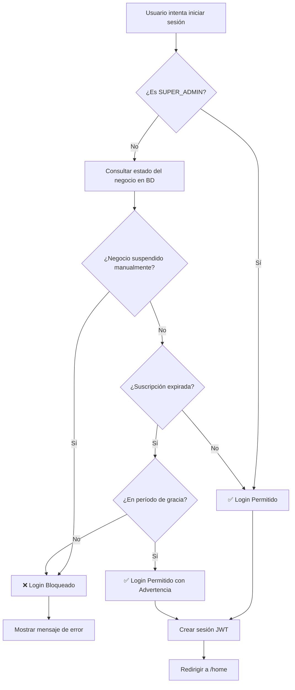

# Sistema de Restricción por Suspensión

## Resumen
Este documento explica cómo funciona el sistema de restricción de acceso cuando un negocio está suspendido o ha expirado su suscripción.

## ⚠️ Enfoque de Implementación

La verificación de suspensión se realiza principalmente en **dos momentos**:

1. **En el Login (authOptions.ts)** - Verificación principal
2. **En el Middleware (middleware.ts)** - Verificación de autenticación básica

### ¿Por qué no en el Middleware de cada request?

El middleware de Next.js se ejecuta en **Edge Runtime**, que no soporta Prisma (base de datos). Por lo tanto:
- ✅ Verificamos en el **login** (Node.js runtime - soporta Prisma)
- ❌ NO verificamos en cada request del middleware (Edge runtime - no soporta Prisma)

## Reglas de Acceso

### 1. Usuarios SUPER_ADMIN
Los usuarios con rol `SUPER_ADMIN` **siempre pueden acceder** al sistema, independientemente del estado de suspensión o expiración del negocio.

### 2. Usuarios Regulares (No SUPER_ADMIN)
Los usuarios regulares **NO pueden iniciar sesión** cuando:

#### a) Suspensión Manual
- El negocio está marcado como `suspended = true` en la base de datos

#### b) Expiración por Más de 7 Días
- La fecha de expiración (`limitTime`) ha pasado hace más de 7 días
- Es decir: fecha actual > (fecha de expiración + 7 días de período de gracia)

### 3. Período de Gracia (7 días)
Durante los 7 días posteriores a la expiración:
- Los usuarios regulares **SÍ pueden iniciar sesión** y usar el sistema
- Se muestra una advertencia de que están en período de gracia
- Después de los 7 días, **se bloquea el login**

### 4. Sesiones Activas
⚠️ **IMPORTANTE:** Si un usuario ya tiene una sesión activa cuando el negocio se suspende:
- La sesión seguirá funcionando hasta que expire o cierre sesión
- En el próximo login, se bloqueará el acceso
- Las sesiones expiran automáticamente a las 6 AM del día siguiente

## Implementación Técnica

### Verificación en Login (authOptions.ts)

```typescript
// Verificar estado de suscripción antes de permitir login
if (user.rol !== "SUPER_ADMIN") {
  const now = new Date();
  const limitTime = new Date(user.negocio.limitTime);
  const daysRemaining = Math.ceil((limitTime.getTime() - now.getTime()) / (1000 * 60 * 60 * 24));
  const isExpired = daysRemaining <= 0;
  const gracePeriodDays = 7;
  const isInGracePeriod = daysRemaining > -gracePeriodDays;
  
  const negocioCompleto = await prisma.negocio.findUnique({
    where: { id: user.negocio.id },
    select: { suspended: true }
  });
  
  const isSuspended = negocioCompleto?.suspended || (isExpired && !isInGracePeriod);
  
  if (isSuspended) {
    throw new Error("Su suscripción ha expirado. Contacte al administrador para renovar.");
  }
}
```

### Middleware Simplificado (subscriptionCheck.ts)

El middleware ahora solo verifica:
1. Que el usuario esté autenticado
2. Que sea SUPER_ADMIN para acceso completo
3. Para usuarios regulares, confía en que la verificación se hizo en el login

```typescript
// Si es SUPER_ADMIN, siempre permitir acceso
if (userRole === 'SUPER_ADMIN') {
  return NextResponse.next();
}

// Para usuarios regulares, permitir acceso (ya se verificó en el login)
return NextResponse.next();
```

## Comportamiento del Usuario

### Escenario 1: Negocio Activo
- Usuario puede iniciar sesión normalmente
- Accede a todas las funciones
- No hay restricciones

### Escenario 2: Negocio Expirado (< 7 días)
- Usuario puede iniciar sesión con advertencia
- Se muestra mensaje de período de gracia
- Todas las funciones están disponibles
- Sesión funciona normalmente

### Escenario 3: Negocio Expirado (> 7 días) o Suspendido
- Usuario regular: **NO puede iniciar sesión**
- Mensaje: "Su suscripción ha expirado. Contacte al administrador para renovar."
- SUPER_ADMIN: Puede iniciar sesión sin restricciones

### Escenario 4: Suspensión Durante Sesión Activa
- Usuario regular con sesión activa: **Puede seguir trabajando**
- En el próximo login: **Será bloqueado**
- SUPER_ADMIN: Sin restricciones

## Ejemplo de Cálculo

### Fecha de Expiración: 1 de Enero 2025

| Fecha Actual | Días Restantes | Estado | Puede Iniciar Sesión |
|--------------|----------------|--------|----------------------|
| 28 Dic 2024  | 4              | Activo | ✅ Sí |
| 1 Ene 2025   | 0              | Expirado | ✅ Sí (Período de gracia) |
| 5 Ene 2025   | -4             | Expirado | ✅ Sí (Período de gracia) |
| 7 Ene 2025   | -6             | Expirado | ✅ Sí (Período de gracia) |
| 8 Ene 2025   | -7             | Expirado | ✅ Sí (Último día de gracia) |
| 9 Ene 2025   | -8             | **SUSPENDIDO** | ❌ NO - Login bloqueado |
| 15 Ene 2025  | -14            | **SUSPENDIDO** | ❌ NO - Login bloqueado |

**Nota:** SUPER_ADMIN siempre puede iniciar sesión (✅) independientemente del estado.

## Flujo de Verificación



## Ventajas de este Enfoque

1. ✅ **Compatible con Edge Runtime**: No requiere Prisma en el middleware
2. ✅ **Eficiente**: Verificación una sola vez en el login, no en cada request
3. ✅ **Simple**: Lógica clara y fácil de mantener
4. ✅ **Seguro**: Bloquea el acceso desde el punto de entrada (login)
5. ✅ **Experiencia de usuario**: No interrumpe sesiones activas abruptamente

## Limitaciones Conocidas

1. ⚠️ **Sesiones activas**: Si un negocio se suspende, los usuarios con sesión activa pueden seguir trabajando hasta que expire su sesión (6 AM del día siguiente)
   - **Mitigación**: Las sesiones son cortas (24 horas máximo)
   - **Alternativa**: Implementar verificación en tiempo real con API routes específicas si es crítico

2. ⚠️ **Cambio de estado**: Si se reactiva un negocio, los usuarios deben hacer login nuevamente para acceder
   - **Mitigación**: Esto es el comportamiento esperado y correcto

## Archivos Modificados

### 1. `src/utils/authOptions.ts`
- ✅ Agregada verificación de suspensión en el proceso de login
- ✅ Bloquea login para usuarios no-SUPER_ADMIN si el negocio está suspendido
- ✅ Calcula días restantes y período de gracia
- ✅ Consulta estado de suspensión manual en la BD

### 2. `src/middleware/subscriptionCheck.ts`
- ✅ Simplificado para no usar Prisma
- ✅ Solo verifica autenticación básica
- ✅ Permite acceso a SUPER_ADMIN siempre
- ✅ Confía en la verificación hecha en el login para usuarios regulares

### 3. `src/middleware.ts`
- ✅ Pasa información del usuario al subscriptionCheck
- ✅ Logs de debugging para troubleshooting

## Verificación en Base de Datos

### Ver estado de un negocio:
```sql
SELECT 
  id, 
  nombre, 
  limitTime,
  suspended,
  JULIANDAY('now') - JULIANDAY(limitTime) as dias_expirado,
  CASE 
    WHEN suspended = 1 THEN 'SUSPENDIDO MANUAL'
    WHEN JULIANDAY('now') - JULIANDAY(limitTime) > 7 THEN 'SUSPENDIDO POR TIEMPO'
    WHEN JULIANDAY('now') > JULIANDAY(limitTime) THEN 'EN PERÍODO DE GRACIA'
    ELSE 'ACTIVO'
  END as estado
FROM Negocio 
WHERE id = 'TU-NEGOCIO-ID';
```

### Suspender manualmente un negocio:
```sql
UPDATE Negocio 
SET suspended = 1 
WHERE id = 'TU-NEGOCIO-ID';
```

### Reactivar un negocio:
```sql
UPDATE Negocio 
SET suspended = 0,
    limitTime = datetime('now', '+30 days')  -- Extender 30 días
WHERE id = 'TU-NEGOCIO-ID';
```

## Testing

### Caso de Prueba 1: Usuario Regular - Negocio Activo
1. Crear negocio con `limitTime` en el futuro
2. Intentar login con usuario no-SUPER_ADMIN
3. **Resultado esperado:** Login exitoso

### Caso de Prueba 2: Usuario Regular - Negocio en Período de Gracia
1. Crear negocio con `limitTime` hace 3 días
2. Intentar login con usuario no-SUPER_ADMIN
3. **Resultado esperado:** Login exitoso con advertencia

### Caso de Prueba 3: Usuario Regular - Negocio Suspendido
1. Crear negocio con `limitTime` hace 10 días (> 7 días)
2. Intentar login con usuario no-SUPER_ADMIN
3. **Resultado esperado:** Login bloqueado con mensaje de error

### Caso de Prueba 4: Usuario Regular - Negocio Suspendido Manualmente
1. Marcar negocio como `suspended = true`
2. Intentar login con usuario no-SUPER_ADMIN
3. **Resultado esperado:** Login bloqueado con mensaje de error

### Caso de Prueba 5: SUPER_ADMIN - Negocio Suspendido
1. Usar cualquier negocio suspendido
2. Intentar login con usuario SUPER_ADMIN
3. **Resultado esperado:** Login exitoso sin restricciones

## Notas Importantes

1. **SUPER_ADMIN siempre accede**: Esto permite gestionar renovaciones y resolver problemas
2. **Período de gracia de 7 días**: Da tiempo razonable para renovar
3. **Suspensión manual prioritaria**: Si `suspended = true`, se bloquea inmediatamente
4. **Verificación en login**: Es el momento más eficiente y compatible
5. **Sesiones limitadas**: Expiran a las 6 AM siguiente, limitando el acceso post-suspensión
