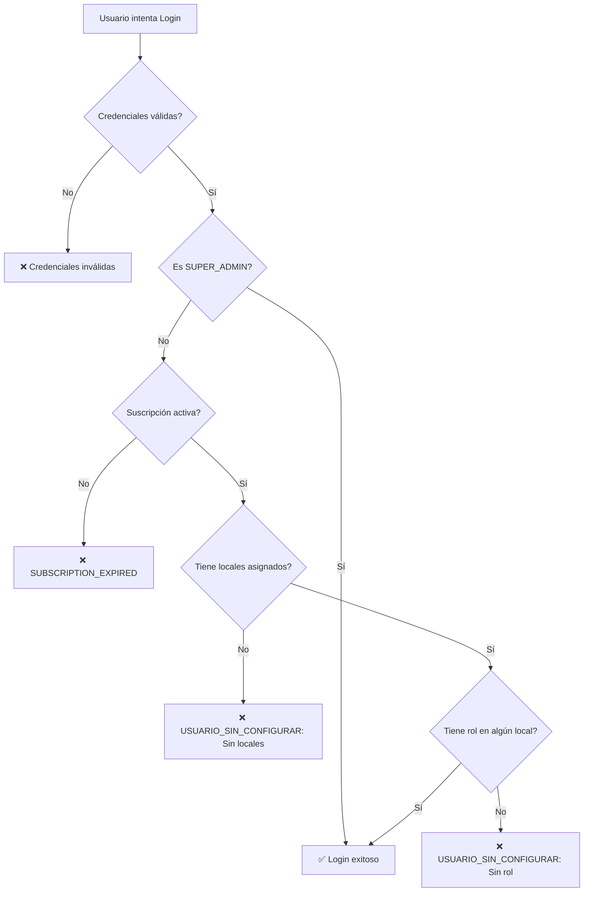

# 🔐 Validación de Usuario Configurado en Login

## 📋 Descripción

Sistema de validación que impide que usuarios **sin configuración completa** puedan autenticarse en el sistema. Esta validación verifica que cada usuario (excepto SUPER_ADMIN) tenga tanto **locales asignados** como **roles configurados** antes de permitir el acceso.

---

## 🎯 Objetivo

Prevenir que usuarios parcialmente configurados puedan acceder al sistema, asegurando que:

1. ✅ Todos los usuarios tengan al menos un **local** (tienda o almacén) asignado
2. ✅ Todos los usuarios tengan al menos un **rol** asignado en algún local
3. ✅ Los usuarios reciban retroalimentación clara sobre qué configuración les falta
4. ✅ Los usuarios sepan cómo contactar al administrador para completar su configuración

---

## 🔍 Casos de Validación

### **Caso 1: Usuario sin locales asignados**

**Condición:**
- Usuario NO es SUPER_ADMIN
- Usuario NO tiene ningún local (tienda o almacén) asignado
- `localesDisponibles.length === 0`

**Acción:**
- ❌ Bloquear autenticación
- 🚫 Mostrar error: "No tienes locales (tiendas o almacenes) asignados"
- 📞 Mostrar información de contacto del administrador

### **Caso 2: Usuario sin rol asignado en ningún local**

**Condición:**
- Usuario NO es SUPER_ADMIN
- Usuario tiene locales asignados
- Usuario NO tiene rol asignado en NINGUNO de esos locales
- No existe registro en `UsuarioTienda` con `rolId != null` para ese usuario

**Acción:**
- ❌ Bloquear autenticación
- 🚫 Mostrar error: "No tienes un rol asignado en ningún local"
- 📞 Mostrar información de contacto del administrador

### **Caso 3: Usuario SUPER_ADMIN**

**Condición:**
- Usuario tiene rol `SUPER_ADMIN`

**Acción:**
- ✅ Permitir autenticación sin validaciones adicionales
- ✅ Tiene acceso a todos los locales del negocio

### **Caso 4: Usuario correctamente configurado**

**Condición:**
- Usuario NO es SUPER_ADMIN
- Usuario tiene al menos un local asignado
- Usuario tiene rol asignado en al menos un local

**Acción:**
- ✅ Permitir autenticación normalmente

---

## 🛠️ Implementación Técnica

### **1. Backend - Validación en `authOptions.ts`**

**Ubicación:** `src/utils/authOptions.ts` (líneas 92-111)

```typescript
// ⚠️ VALIDACIÓN: Usuario debe tener locales asignados (excepto SUPER_ADMIN)
if (user.rol !== "SUPER_ADMIN") {
  // Verificar si tiene locales asignados
  if (localesDisponibles.length === 0) {
    throw new Error("USUARIO_SIN_CONFIGURAR: No tienes locales (tiendas o almacenes) asignados. Contacta al administrador para completar tu configuración.");
  }

  // Verificar si tiene al menos un rol asignado en algún local
  const tieneRolAsignado = await prisma.usuarioTienda.findFirst({
    where: {
      usuarioId: user.id,
      rolId: { not: null } // Tiene un rol asignado
    },
    select: { id: true }
  });

  if (!tieneRolAsignado) {
    throw new Error("USUARIO_SIN_CONFIGURAR: No tienes un rol asignado en ningún local. Contacta al administrador para completar tu configuración.");
  }
}
```

**Características:**
- ✅ Se ejecuta DESPUÉS de verificar suscripción
- ✅ Se ejecuta ANTES de generar el token JWT
- ✅ Usa consulta eficiente a la BD (`findFirst` con `select: { id: true }`)
- ✅ Lanza errores con prefijo `USUARIO_SIN_CONFIGURAR:` para identificación en el frontend

---

### **2. Frontend - Detección y Visualización de Errores**

#### **A. Detección del Error en `handleSubmit`**

**Ubicación:** `src/app/login/page.tsx` (líneas 58-71)

```typescript
if (result?.error) {
  // Detectar si es error de suscripción expirada
  if (result.error.includes("SUBSCRIPTION_EXPIRED")) {
    setError("SUBSCRIPTION_EXPIRED");
  } 
  // Detectar si es error de usuario sin configurar
  else if (result.error.includes("USUARIO_SIN_CONFIGURAR")) {
    // Extraer el mensaje completo del error
    const mensajeError = result.error.split(": ")[1] || result.error;
    setError(`USUARIO_SIN_CONFIGURAR: ${mensajeError}`);
  } 
  else {
    setError("Credenciales inválidas. Verifica tu usuario y contraseña.");
  }
}
```

#### **B. Visualización del Error**

**Ubicación:** `src/app/login/page.tsx` (líneas 267-391)

**Componente Alert con:**
- 🟠 Severidad: `warning` (color naranja)
- ⚠️ Icono: Warning
- 📝 Título: "Usuario Sin Configurar"
- 📄 Mensaje: Extraído del error
- 📞 Información de contacto:
  - 3 enlaces de WhatsApp con mensaje predefinido
  - 1 email de contacto

**Ejemplo Visual:**

```
┌────────────────────────────────────────────────────────┐
│ ⚠️  Usuario Sin Configurar                            │
│                                                        │
│ No tienes locales (tiendas o almacenes) asignados.    │
│ Contacta al administrador para completar tu           │
│ configuración.                                         │
│                                                        │
│ ─────────────────────────────────────────────────────│
│                                                        │
│ Para completar tu configuración, contacta al          │
│ administrador:                                         │
│                                                        │
│ 💬 +53 5 4319958                                      │
│ 💬 +53 53334449                                       │
│ 💬 +598 97728107                                      │
│ 📧 adrianfdez469@gmail.com                            │
└────────────────────────────────────────────────────────┘
```

---

## 📊 Flujo de Validación



---

## 🧪 Casos de Prueba

### **Test 1: Usuario sin locales**

**Setup:**
```sql
-- Usuario existe pero NO tiene locales asignados
DELETE FROM UsuarioTienda WHERE usuarioId = 'test-user-id';
```

**Resultado Esperado:**
- ❌ Login bloqueado
- 🟠 Alert naranja: "Usuario Sin Configurar"
- 📝 Mensaje: "No tienes locales (tiendas o almacenes) asignados..."
- 📞 Contactos visibles

---

### **Test 2: Usuario sin rol**

**Setup:**
```sql
-- Usuario tiene locales pero sin rol asignado
UPDATE UsuarioTienda 
SET rolId = NULL 
WHERE usuarioId = 'test-user-id';
```

**Resultado Esperado:**
- ❌ Login bloqueado
- 🟠 Alert naranja: "Usuario Sin Configurar"
- 📝 Mensaje: "No tienes un rol asignado en ningún local..."
- 📞 Contactos visibles

---

### **Test 3: Usuario parcialmente configurado**

**Setup:**
```sql
-- Usuario tiene 3 locales, pero solo tiene rol en 1
INSERT INTO UsuarioTienda (usuarioId, tiendaId, rolId) VALUES
  ('test-user-id', 'tienda-1', NULL),
  ('test-user-id', 'tienda-2', 'rol-id'), -- Tiene rol aquí
  ('test-user-id', 'tienda-3', NULL);
```

**Resultado Esperado:**
- ✅ Login exitoso (tiene rol en al menos UN local)

---

### **Test 4: SUPER_ADMIN sin locales**

**Setup:**
```sql
-- Usuario SUPER_ADMIN sin locales asignados
UPDATE Usuario 
SET rol = 'SUPER_ADMIN' 
WHERE id = 'test-user-id';

DELETE FROM UsuarioTienda WHERE usuarioId = 'test-user-id';
```

**Resultado Esperado:**
- ✅ Login exitoso (SUPER_ADMIN no requiere validación)

---

### **Test 5: Usuario correctamente configurado**

**Setup:**
```sql
-- Usuario con local y rol asignado
INSERT INTO UsuarioTienda (usuarioId, tiendaId, rolId) VALUES
  ('test-user-id', 'tienda-1', 'rol-vendedor-id');
```

**Resultado Esperado:**
- ✅ Login exitoso

---

## 🎨 Diseño de UI

### **Comparación con SUBSCRIPTION_EXPIRED**

| Aspecto | SUBSCRIPTION_EXPIRED | USUARIO_SIN_CONFIGURAR |
|---------|---------------------|------------------------|
| **Color** | 🔴 Rojo (error) | 🟠 Naranja (warning) |
| **Severidad** | `error` | `warning` |
| **Título** | "Suscripción Expirada" | "Usuario Sin Configurar" |
| **Acción** | Renovar suscripción | Contactar administrador |
| **Responsable** | Negocio/Administrador | Administrador del sistema |

---

## 📞 Información de Contacto

Los usuarios ven los siguientes métodos de contacto:

### **WhatsApp (3 números)**
- +53 5 4319958
- +53 53334449
- +598 97728107

**Mensaje predefinido:**
```
Hola, mi usuario no está completamente configurado en Cuadre de Caja. ¿Podrían ayudarme?
```

### **Email**
- adrianfdez469@gmail.com

---

## 🔧 Configuración del Administrador

Para que un usuario pueda loguearse, el administrador debe:

### **1. Asignar Local(es)**

En la interfaz de gestión de usuarios:
- Ir a Configuración → Usuarios
- Seleccionar el usuario
- Asignar al menos 1 local (tienda o almacén)

**Base de datos:**
```sql
INSERT INTO UsuarioTienda (usuarioId, tiendaId, rolId)
VALUES ('usuario-id', 'tienda-id', NULL);
```

### **2. Asignar Rol**

En la interfaz de gestión de usuarios:
- Ir a Configuración → Usuarios
- Seleccionar el usuario
- En cada local asignado, asignar un rol

**Base de datos:**
```sql
UPDATE UsuarioTienda 
SET rolId = 'rol-id'
WHERE usuarioId = 'usuario-id' 
  AND tiendaId = 'tienda-id';
```

---

## 📊 Estadísticas de Validación

### **Consultas útiles para administradores**

#### **Usuarios sin locales asignados**
```sql
SELECT u.id, u.nombre, u.usuario
FROM Usuario u
LEFT JOIN UsuarioTienda ut ON u.id = ut.usuarioId
WHERE u.rol != 'SUPER_ADMIN' 
  AND ut.id IS NULL;
```

#### **Usuarios sin rol asignado**
```sql
SELECT DISTINCT u.id, u.nombre, u.usuario
FROM Usuario u
INNER JOIN UsuarioTienda ut ON u.id = ut.usuarioId
WHERE u.rol != 'SUPER_ADMIN'
  AND ut.rolId IS NULL;
```

#### **Usuarios sin configurar (cualquiera de los dos)**
```sql
-- Usuarios sin locales O sin rol
SELECT u.id, u.nombre, u.usuario,
  COUNT(ut.id) as locales_asignados,
  COUNT(CASE WHEN ut.rolId IS NOT NULL THEN 1 END) as locales_con_rol
FROM Usuario u
LEFT JOIN UsuarioTienda ut ON u.id = ut.usuarioId
WHERE u.rol != 'SUPER_ADMIN'
GROUP BY u.id, u.nombre, u.usuario
HAVING COUNT(ut.id) = 0 OR COUNT(CASE WHEN ut.rolId IS NOT NULL THEN 1 END) = 0;
```

---

## 🚀 Beneficios de esta Validación

1. ✅ **Seguridad mejorada:** Solo usuarios completamente configurados pueden acceder
2. ✅ **Menos errores:** Evita usuarios parcialmente configurados causando problemas en el sistema
3. ✅ **Feedback claro:** Los usuarios saben exactamente qué les falta
4. ✅ **Facilita soporte:** Información de contacto visible inmediatamente
5. ✅ **Integridad de datos:** Garantiza que todos los usuarios tengan permisos válidos
6. ✅ **Mejor experiencia:** Evita confusión de usuarios que "entran pero no pueden hacer nada"

---

## 📝 Notas Importantes

### **Excepciones**
- ✅ Usuarios con rol `SUPER_ADMIN` están **exentos** de estas validaciones
- ✅ SUPER_ADMIN tiene acceso a todos los locales del negocio automáticamente

### **Orden de Validaciones en Login**
1. ✅ Credenciales válidas (usuario y contraseña)
2. ✅ Suscripción activa (excepto SUPER_ADMIN)
3. ✅ **Locales asignados (NUEVA - excepto SUPER_ADMIN)**
4. ✅ **Rol asignado (NUEVA - excepto SUPER_ADMIN)**

### **Validación vs Permiso**
- **Validación:** Bloquea el login completamente
- **Permiso:** Permite login pero restringe acciones específicas

Esta validación es más estricta porque garantiza que el usuario está **completamente configurado** antes de entrar al sistema.

---

## ✅ Checklist de Implementación

- [x] Validación de locales asignados en backend
- [x] Validación de rol asignado en backend
- [x] Manejo de errores específicos con prefijo `USUARIO_SIN_CONFIGURAR`
- [x] Detección de error en frontend
- [x] Alert visual con información clara
- [x] Enlaces de WhatsApp con mensaje predefinido
- [x] Email de contacto visible
- [x] Excepciones para SUPER_ADMIN
- [x] Sin errores de linter
- [x] Documentación completa

---

## 🎉 Resultado Final

Los usuarios ahora **deben estar completamente configurados** (locales + roles) antes de poder acceder al sistema. Si les falta configuración, reciben:

1. ⚠️ **Mensaje claro** explicando qué falta
2. 📞 **Contactos del administrador** para resolver el problema
3. 🚫 **Bloqueo de acceso** hasta completar la configuración

**¡Protección completa del sistema contra usuarios mal configurados!** 🔐

